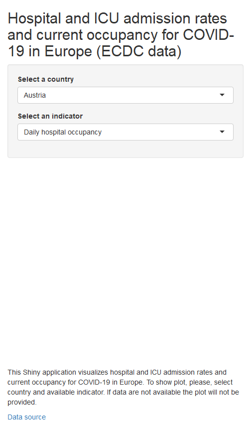

Developing Data Products - Course Project
========================================================
author: Sabina Rako
date: 3. 1. 2022
autosize: true

Data source
========================================================

ECDC (European Centre for Disease Prevention and Control)

<https://www.ecdc.europa.eu/en/publications-data/download-data-hospital-and-icu-admission-rates-and-current-occupancy-covid-19>

Data are loaded from directly from csv file available at opendata.ecdc.europe.edu portal. This approach provides regular data update. 


```r
data <- read.csv("https://opendata.ecdc.europa.eu/covid19/hospitalicuadmissionrates/csv/data.csv", na.strings = "", fileEncoding = "UTF-8-BOM")
```


About data (1/2)
========================================================
Dataset contains data on hospital and ICU admission rates and current occupancy for COVID-19. As can be seen, there are 7 variables. Today (3th January 2022) there are 30 935 observations available. 

Variable **indicator** contains these four indicators: Daily hospital occupancy, Daily ICU occupancy, Weekly new hospital admissions per 100k and Weekly new ICU admissions per 100k.
Variable **value** represents *Number of patients or new admissions per 100k population*. 

About data (2/2)
========================================================


```
'data.frame':	30935 obs. of  7 variables:
 $ country  : chr  "Austria" "Austria" "Austria" "Austria" ...
 $ indicator: chr  "Daily hospital occupancy" "Daily hospital occupancy" "Daily hospital occupancy" "Daily hospital occupancy" ...
 $ date     : chr  "2020-04-01" "2020-04-02" "2020-04-03" "2020-04-04" ...
 $ year_week: chr  "2020-W14" "2020-W14" "2020-W14" "2020-W14" ...
 $ value    : num  856 823 829 826 712 824 857 829 820 771 ...
 $ source   : chr  "Country_Website" "Country_Website" "Country_Website" "Country_Website" ...
 $ url      : chr  "https://covid19-dashboard.ages.at/dashboard_Hosp.html" "https://covid19-dashboard.ages.at/dashboard_Hosp.html" "https://covid19-dashboard.ages.at/dashboard_Hosp.html" "https://covid19-dashboard.ages.at/dashboard_Hosp.html" ...
```


Shiny application
========================================================
Shiny application is available at <https://sabinar.shinyapps.io/DDPCourseProject/>. 

```r
knitr::include_app(url = "https://sabinar.shinyapps.io/DDPCourseProject/")
```

[](https://sabinar.shinyapps.io/DDPCourseProject/)


How to use this application?
========================================================
To show plot, please, select country and available indicator. If data are not available the plot will not be provided.

Let's beat COVID-19 together!


Thank you!
========================================================


